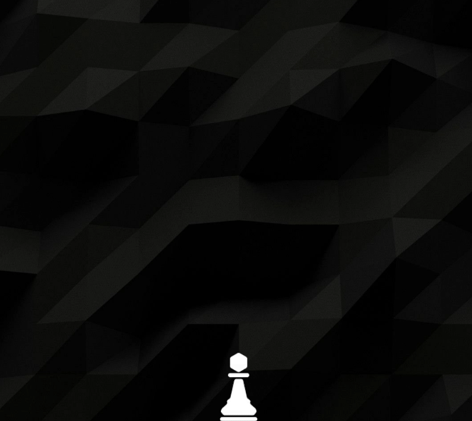

# Play-chess-on-desktop
A desktop program that lets users play chess either against others or a simple AI.

<p>
  
</p>

<br>

## 🛠️ Why I built this  
- I’ve always wanted to play chess on my desktop.  
- It’s a great opportunity to learn how computers play chess.  
- It’s fun to “teach” a computer how to play the game.  

<br>

## 🧩 Features
- 🎮 **Interactive Chessboard** – Drag, click, and play directly on screen  
- 🤖 **AI Opponent** – Simple minimax engine with positional evaluation  
- 💾 **Save & Load** – Game automatically stored in `chess_save.json`  
- ⏪ **Undo / Redo / Replay** – Step through previous game states  
- 🔁 **Board Flip** – Instantly switch perspective  
- 🧠 **AI Move Highlights** – Shows AI’s thinking process  
- ♟️ **Pawn Promotion UI** – Pick your new piece visually  
- 🎬 **Animated Launcher** – Start the game via `chess_button.py` with pawn animation  

<br>

## 📂 Project Structure
```
Desktop chess/
├── image/               # Chessboard graphics
├── video/               # PawnPromotion.mp4 animation
├── chess_board.py       # Main GUI and game control
├── chess_button.py      # Animation launcher and game toggle
├── chess_engine.py      # AI logic (minimax + evaluation)
├── chess_logic.py       # Core chess rules and move validation
├── chess_save.json      # Auto-saved game data
├── LICENSE              # License file
└── README.md            # MIT license
```

<br>

## ⚙️ Requirements
Install dependencies before running:
```bash
pip install pillow opencv-python numpy
```

<br>

## ▶️ How to Run
1. Make sure the folders **`/image`** and **`/video`** exist and contain required assets.  
2. Start the launcher:
   ```bash
   python chess_button.py
   ```
3. Click the pawn button at the bottom middle of the screen to open or close the main chess window.

<br>

## ⌨️ Hotkeys
| Key | Action |
|-----|--------|
| `W` | Toggle continuous AI |
| `E` | Single AI move |
| `R` | Reset board |
| `T` | Flip board |
| `S` | Random move |
| `D` | Undo |
| `F` | Redo |
| `G` | Replay game |

<br>

## 📜 License  
This project is released under the **MIT License**.  
Feel free to modify and use for learning or personal projects.  

**Let the chess game begin!**
